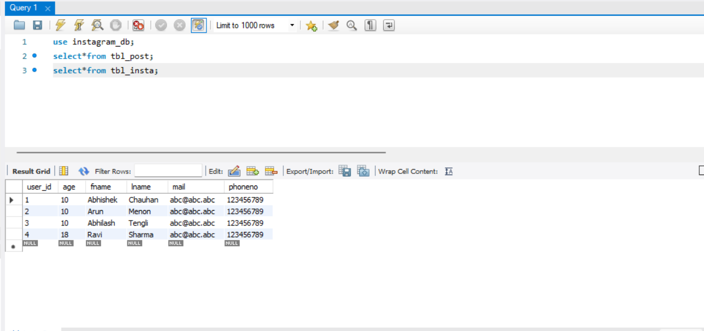
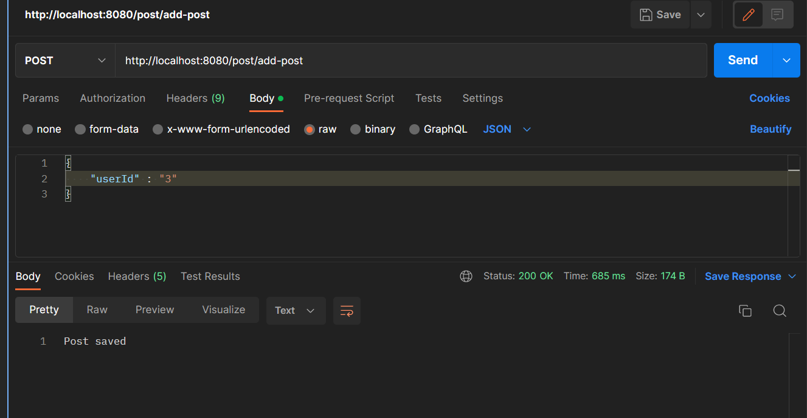

# Instagram Project
## Controller
- UserController
- PostController  
## Model
- UserModel
- PostModel  
## Service 
- UserService
- PostService  
## DataBase used 
- MySql  
  
## Project Summary 
- Here In this project performing the CRUD operations to save the User information and Post Information  
  ### User 
- 1)PostMapping -> http://localhost:8080/user/add-user  
  
- 2)GetMapping -> http://localhost:8080/getuser  
  
- 3)GetMapping -> http://localhost:8080/getuserbyid/userid/4 (By ID)   
  ### Post 
- 1)PostMapping -> http://localhost:8080/post/add-post  
  
- 2)GetMapping -> http://localhost:8080/findallpost  
  
- 3)GetMapping -> http://localhost:8080/findpostbyid//4 (By ID)  
- 4)DeleteMapping -> http://localhost:8080/deletebyid/2  
  
