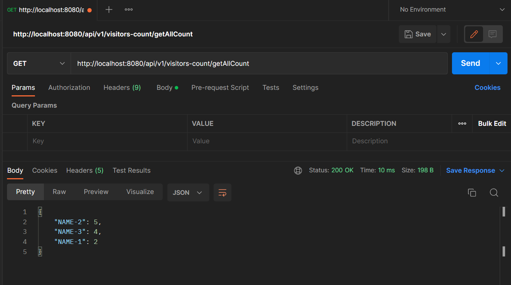

# URL Hit Counter API.

This project shows how many users have hit apis along with their username.

# How to use.

**1.)Suppose to get users count:- _(http://localhost:8080/api/v1/visitors-count/username/{username}/count)_**
using POSTMAN
---

---
**2.) To get All users:- _(http://localhost:8080/api/v1/visitors-count/getAllCount)_**

