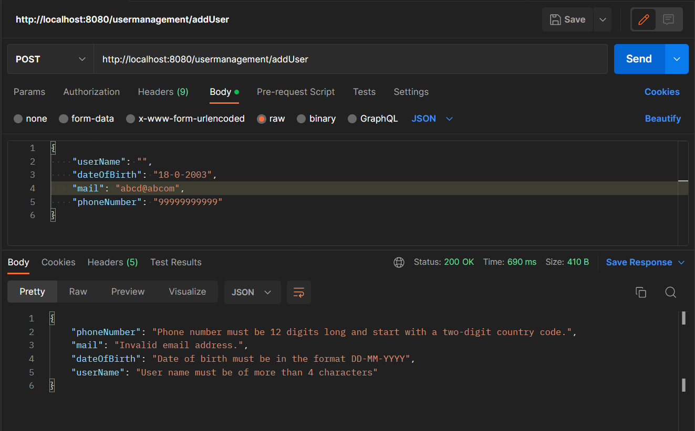

# Frameworks and language used

- Springboot
- Java

# Data flow(functions..)

## controller

### UserControl class
- Add User
- update 
- Delete 
- Get User
- Get User by id

 

## Service
- ### UserService class

  

## Model
- ### UserModel Class

 

## Repository
- ### UserRepo Interface
 

## H2 Database
 

# Data structure used
- ArrayList
- HashMap

# Project summary
Here in this project we are doing the CRUD operations on User Management which includes the User Model with validation using spingboot annotation and to this the below operation are done.
- 1) GET
- 2) POST
- 3) PUT
- 4) DELETE
- 5) @NotBlank
- 6) @Email
- 7) @Pattern
- 8) @Size, @Length
- 9) @Min, @Max

### Validation error

### User by ID
